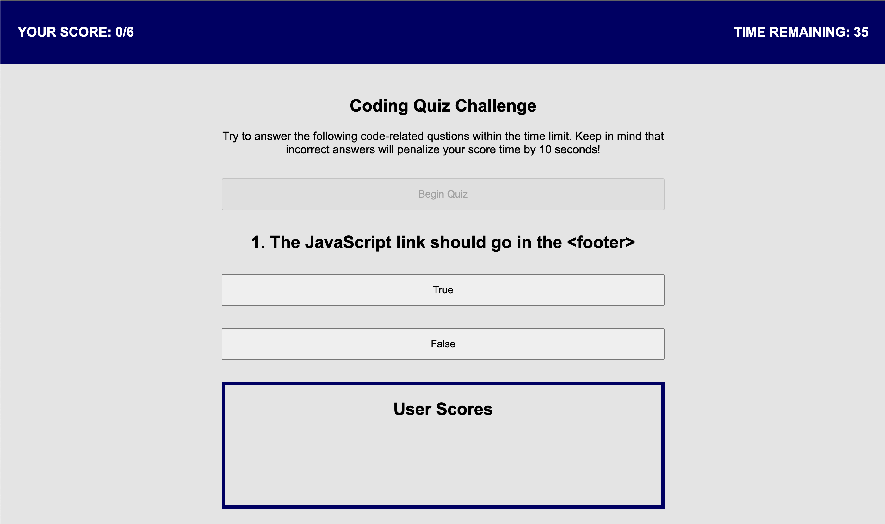

# Code Quiz

## Table of Contents
- [Description](#description)
- [Link](#link)
- [Screenshot](#screenshot)

## Description
This project was created for students enrolled in coding boot camp to test their knowledge of JavaScript fundamentals. This quiz is timed and will record their scores so they can see their progress as they retake the quiz.

## Link
[Click to view my deployed portfolio GitHub Page](https://maggiemcc.github.io/code-quiz/)

## Screenshot
